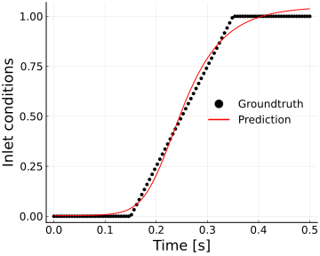
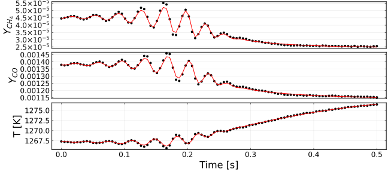
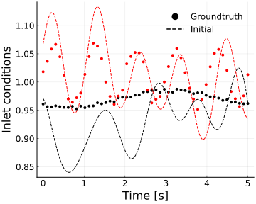

# NN-PSR

Differentiable Perfect Stirred Reactor Simulation using Arrhenius.jl.

### Governing Equations for the Model Combustor

$$
\begin{align*}
\frac{dY}{dt} &= \frac{\pmb Y_{in}-\pmb Y}{\tau_{res}} + \pmb S(\pmb Y) \\
\frac{dT}{dt} &= \frac{\sum_i q_i R_i}{\rho C_p} - \frac{T-T_{in}}{\tau_{res}} - \frac{Q_{loss}(T-T_a)}{\rho C_p} \\
\tau_{res} &= \frac{\rho V}{m_a}
\end{align*}
$$

### Inverse Modeling for Fuel Switching

Fuel switching from COG1 to COG2, trained with 100 data points

+ Initial state

+ Trained state

### Inverse Modeling for Inflow Fluctuations

Inflow fluctuations of BFG fuel, with 3% calorific fluctuation and 10% flow rate fluctuation.

+ Initial state

+ Trained state

